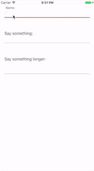

# MultilineTextField

MultilineTextField is a Android style textfield that supports multiline text. Moreover, MultilineTextField includes a seperator line and placeholder label.



## Getting Started

### Prerequisites

```
Swift 3
Xcode 8
```

### Installing

Add this line on your Podfile file.

```
pod 'FHMultilineTextField'
```

And run on your terminal

```
pod install
```

Don't forget the work on your .xcworkspace file.

### Usage

An example

```
        let multilineTextField = MultilineTextField(frame: CGRect(x: 20, y: 100, width: view.bounds.width - 40, height: 70))
        multilineTextField.lineColorSelected = UIColor.red          // default is UIColor.darkGray
        multilineTextField.lineColorUnselected = UIColor.black      // default is UIColor.darkGray
        multilineTextField.placeHolderText = "Address:"
        multilineTextField.placeHolderTextColor =  UIColor.black    // default is UIColor.darkGray
        multilineTextField.textColor = UIColor.black                // default is UIColor.darkGray
        multilineTextField.textView.returnKeyType = .done
        multilineTextField.endEditingWithReturnButton = true        // default is false
        view.addSubview(multilineTextField)
```
### To-Do

- [ ] Swift 4 support
- [ ] Line animations
- [ ] More customization

## Built With

* [GrowingTextView](https://github.com/KennethTsang/GrowingTextView)

## License

This project is licensed under the MIT License - see the [LICENSE.md](LICENSE.md) file for details
